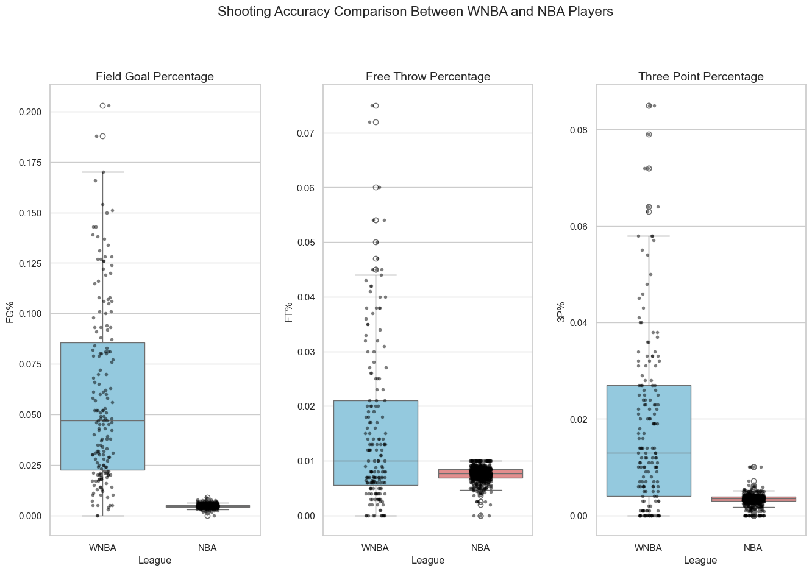
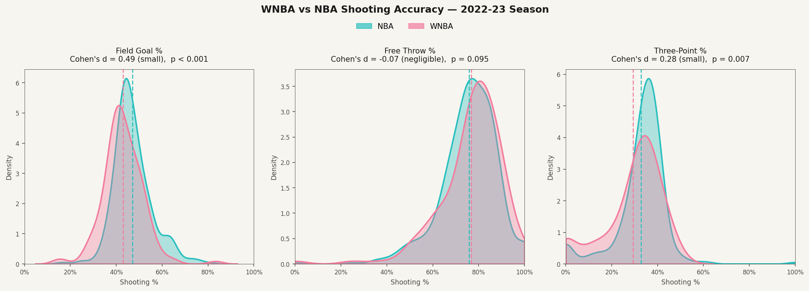
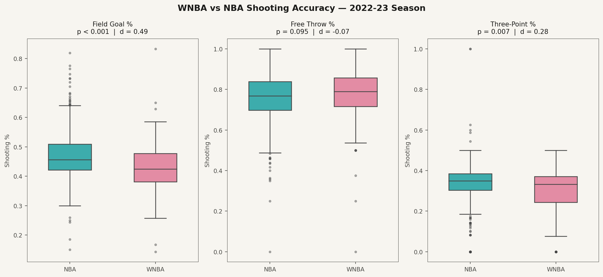

# WNBA vs NBA Shooting Accuracy



**Data source:** Basketball Reference · 2022-23 season · min. 10 games played  
**Status:** v1 — clean baseline analysis. [See the roadmap](#roadmap) for what's coming next.

---

## What We Found

NBA players shoot slightly better from the field and from three. At the free throw line, the difference is negligible and not statistically significant.

| Metric | NBA | WNBA | Difference | Significant? |
|---|---|---|---|---|
| Field Goal % | 47.1% | 42.9% | 4.2 pp | Yes |
| Free Throw % | 75.8% | 76.7% | −0.9 pp | No |
| Three-Point % | 32.8% | 29.4% | 3.4 pp | Yes |

The gaps in FG% and 3P% are real — but small. The free throw result is the most telling: when both leagues shoot from the same distance, with no defense, no shot clock, and no athleticism differential, the numbers are essentially identical.

**What these numbers can't tell us** is whether the gap reflects talent. It reflects the output of two leagues with different salaries, training resources, roster sizes, player pipelines, and competitive structures. A fair talent comparison would need to control for shot difficulty, minutes played, position, age, and investment per player. This analysis does none of that — intentionally, for v1. Those controls are on the roadmap.

---

## What the Numbers Actually Mean

The statistical results include **Cohen's d**, an effect size measure that puts the difference between two groups on a common scale. Here's the math and then the plain-language version.

**The formula:**

```
d = (mean₁ − mean₂) / pooled standard deviation
```

The pooled standard deviation is the average spread of both groups combined. So d answers: *how many "standard deviations apart" are these two groups?* It's a signal-to-noise ratio — it tells you whether the difference is large relative to how much natural variation exists within each group.

**Conventional benchmarks** (Cohen, 1988): d < 0.2 = negligible · 0.2–0.5 = small · 0.5–0.8 = medium · > 0.8 = large

**Plain-language translation** using the Common Language Effect Size — the probability that a randomly selected player from one group outperforms a randomly selected player from the other:

- **FG% (d = 0.49):** If you picked one random NBA player and one random WNBA player, the NBA player would have the higher field goal percentage about **63% of the time**. Not 90%. Not 51%. The distributions overlap heavily.
- **FT% (d = −0.07):** Essentially a coin flip — **52% of the time** the NBA player shoots better from the line. This difference is indistinguishable from noise.
- **3P% (d = 0.28):** The NBA player would shoot better from three about **58% of the time**.

These are small effects. They are worth noting honestly — but they are nowhere near "different leagues, different level of play."

---

## Visualizations

**Distribution plots** — where the two leagues actually sit, with mean lines and individual player rug marks:



**Box plots** — spread, median, and outliers side by side:



---

## Methods (For the Statisticians)

**Data collection:** Scraped from Basketball Reference using `pandas.read_html`. The NBA table injects repeated header rows every 20 rows — these were filtered by removing any row where `Player == "Player"`. WNBA percentage columns were stored as strings with a leading dot (`.399`) and parsed with `pd.to_numeric`.

**Deduplication:** Basketball Reference lists traded players once per team plus a `TOT` summary row. We kept the `TOT` row where present, otherwise the row with the highest games played. This removed 116 duplicate NBA rows and 9 WNBA rows, leaving NBA n=470 and WNBA n=141.

**Minimum threshold:** Players with fewer than 10 games played were excluded to reduce noise from small samples.

**Test selection:** For each metric, we ran:
1. Shapiro-Wilk normality test on each group
2. Levene's test for equality of variances
3. If both groups normal and variances equal → independent t-test. If normal but unequal variances → Welch's t-test. If either group non-normal → Mann-Whitney U (two-sided).

All three metrics failed normality (Shapiro-Wilk p < 0.001 across the board), so Mann-Whitney U was used for all comparisons.

**Full results:**

```
FG%
  NBA:  mean=0.471  std=0.084  n=470
  WNBA: mean=0.429  std=0.086  n=141
  Shapiro-Wilk: NBA p=7.66e-12  WNBA p=1.22e-04  → non-normal
  Levene: p=0.719  → equal variances
  Mann-Whitney U: stat=42676.5  p=2.10e-07
  Cohen's d: +0.49  (small effect)

FT%
  NBA:  mean=0.758  std=0.124  n=467
  WNBA: mean=0.767  std=0.139  n=140
  Shapiro-Wilk: NBA p=9.69e-13  WNBA p=1.20e-09  → non-normal
  Levene: p=0.574  → equal variances
  Mann-Whitney U: stat=29653.5  p=0.095
  Cohen's d: −0.07  (negligible effect)

3P%
  NBA:  mean=0.328  std=0.114  n=462
  WNBA: mean=0.294  std=0.127  n=133
  Shapiro-Wilk: NBA p=7.98e-23  WNBA p=1.46e-08  → non-normal
  Levene: p=0.021  → unequal variances
  Mann-Whitney U: stat=35400.5  p=7.41e-03
  Cohen's d: +0.28  (small effect)
```

**Effect size note:** Cohen's d was computed using the pooled standard deviation formula regardless of test selection, as it remains a useful descriptive measure even when the underlying distributions are non-normal. The Common Language Effect Size was derived from d using Φ(d/√2) where Φ is the standard normal CDF.

---

## A Note on Data Quality

The original version of this analysis contained serious data errors. The WNBA percentages had been double-divided (stored as `0.056` and then divided by 100 again), and NBA duplicate player rows were not removed before analysis. The original Cohen's d for FG% was reported as 2.63 — a large effect — compared to the correct value of 0.49.

This was caught during a post-hoc audit. The original CSVs have been removed. The current analysis is fully reproducible from `scripts/build_analysis.py`, which scrapes, cleans, validates, deduplicates, and reruns the full analysis from scratch. Auditing your own work and correcting it is part of doing statistics honestly.

---

## Reproducing This Analysis

```bash
git clone https://github.com/James-Winslow/wnba-vs-nba.git
cd wnba-vs-nba
pip install pandas numpy matplotlib seaborn scipy
python3 scripts/build_analysis.py
```

This will regenerate `data/nba_clean.csv`, `data/wnba_clean.csv`, `data/combined_clean.csv`, `data/analysis_results.txt`, and both images in `images/`.

**Notebooks** in `notebooks/` contain the original exploratory work and are preserved for transparency, though the canonical analysis is now `scripts/build_analysis.py`.

---

## Roadmap

This is a living analysis. Each version will be documented with what changed and why.

**v2 — Better controls**
- Minutes-weighted analysis: compare heavy-minutes players to heavy-minutes players, filtering out end-of-roster players who drag down averages in both leagues
- Position-matched comparison: guards vs guards, forwards vs forwards — shooting profiles differ significantly and league compositions may not be identical
- Bootstrap confidence intervals around effect sizes to make uncertainty visible, not just point estimates

**v3 — Bayesian estimation**
- Instead of asking "is there a difference?" (frequentist), ask "what is the distribution of plausible differences?"
- Hierarchical model partially pooling across positions
- Prior specification and sensitivity analysis

**v4 — Structural argument**
- Multi-season data for stability
- Salary and investment data per player if obtainable
- The gap as a function of resources, not just outcomes

The goal is always to answer the question as honestly as possible with whatever data is available — and to be transparent when the data can't answer it yet.

---

## Repository Structure

```
wnba-vs-nba/
├── data/
│   ├── nba_clean.csv          # Cleaned NBA data (470 players)
│   ├── wnba_clean.csv         # Cleaned WNBA data (141 players)
│   ├── combined_clean.csv     # Both leagues combined
│   └── analysis_results.txt  # Full statistical output
├── images/
│   ├── header.png
│   ├── shooting_distributions.png
│   └── shooting_boxplots.png
├── scripts/
│   └── build_analysis.py     # Full reproducible pipeline
└── README.md
```

---

*Built by [Jimmy Winslow](https://james-winslow.github.io) · Denver, CO*  
*Feedback, corrections, and pull requests welcome.*
